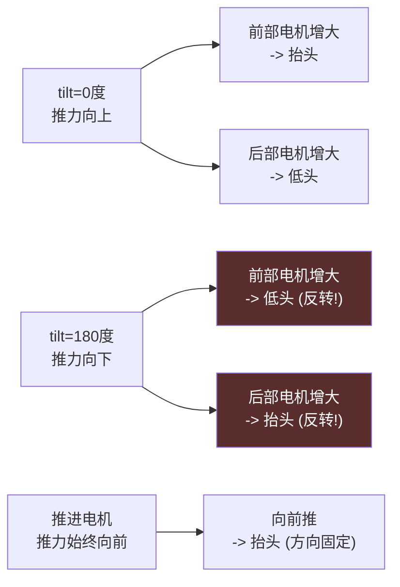

# Gazebo 配置理解笔记

> 本文档基于灵云01号飞艇 Gazebo Harmonic 仿真配置，记录对 Gazebo SDF 配置的个人理解。

## 1. 核心概念

### 1.1 Link（连杆）

Link 是 Gazebo 中的**刚性物理部件**，包含以下属性：

```xml
<link name="base_link">
  <pose>X Y Z Roll Pitch Yaw</pose>  <!-- 位置和姿态 -->
  <inertial>...</inertial>           <!-- 质量、惯性 -->
  <collision>...</collision>         <!-- 碰撞体 -->
  <visual>...</visual>               <!-- 视觉外观 -->
</link>
```

| 属性          | 说明                                     |
| ----------- | -------------------------------------- |
| `pose`      | Link 相对于\*\*模型帧(Model Frame)\*\*的位置和姿态 |
| `inertial`  | 质量、转动惯量、重心位置                           |
| `collision` | 用于物理碰撞计算的几何体                           |
| `visual`    | 用于渲染显示的模型文件(STL/DAE)                   |

### 1.2 Joint（关节）

Joint 连接两个 Link，定义它们之间的运动关系：

```xml
<joint name="example_joint" type="revolute">
  <parent>parent_link</parent>
  <child>child_link</child>
  <pose>X Y Z Roll Pitch Yaw</pose>  <!-- 关节位置 -->
  <axis>
    <xyz>1 0 0</xyz>                 <!-- 旋转轴方向 -->
    <use_parent_model_frame>0</use_parent_model_frame>
  </axis>
</joint>
```

| 属性             | 说明                                        |
| -------------- | ----------------------------------------- |
| `type`         | 关节类型：revolute(旋转)、prismatic(滑动)、fixed(固定) |
| `parent/child` | 连接的父子 Link                                |
| `pose`         | 关节位置（相对于**子Link帧**）                       |
| `axis`         | 运动轴方向                                     |

### 1.3 Link 与 Joint 的层次关系

```
Link 是"物体"，Joint 是"连接关系"

┌─────────────────────────────────────────┐
│                                         │
│  World                                  │
│    │                                    │
│    └── base_link ── Joint ── child_link │
│                                         │
└─────────────────────────────────────────┘
```

## 2. Pose（位置姿态）详解

### 2.1 Link Pose

```xml
<link name="example">
  <pose>X Y Z Roll Pitch Yaw</pose>
</link>
```

Link 的 pose 表示\*\*相对于模型帧(Model Frame)\*\*的位置和姿态：

- **X, Y, Z**: 位置偏移（米）
- **Roll, Pitch, Yaw**: 欧拉角旋转（弧度）

> 参考：SDFormat规范规定 "all link poses are specified relative to the model frame"

```
┌─────────────────────────────────────────┐
│                                         │
│  Model Frame                            │
│       │                                 │
│       │  Link Pose = (1, 2, 3, 0, 0, 0) │
│       ↓                                 │
│  ┌────────────────┐                    │
│  │  This Link     │                    │
│  │  在模型帧X+1,  │                    │
│  │  Y+2, Z+3位置  │                    │
│  └────────────────┘                    │
│                                         │
└─────────────────────────────────────────┘
```

### 2.2 Joint Pose

根据 SDFormat 规范，**`<joint><pose>`** **是相对于子Link帧**的位置和朝向。

> 参考：SDFormat规范 "joint frames relative to their child link frames"

当 Joint 没有显式 `<pose>` 时，Joint 位于子 Link 的坐标系原点处。

注意：`<use_parent_model_frame>` 是 `<axis>` 的属性，控制旋转轴方向向量的参考坐标系，与 Joint Pose 无关。

| use\_parent\_model\_frame | axis 参考系               |
| ------------------------- | ---------------------- |
| 0（默认）                     | 父 Link 的局部坐标系          |
| 1                         | 模型坐标系（通常等于 base\_link） |

### 2.3 Visual/Collision Pose

视觉和碰撞体的 pose 表示**相对于 Link 原点**的位置：

```xml
<link name="example">
  <visual name="v">
    <pose>0 0 0 0 0 0</pose>  <!-- 视觉在 Link 原点 -->
  </visual>
  <collision name="c">
    <pose>0.5 0 0 0 0 0</pose>  <!-- 碰撞体偏移到 Link X+0.5 -->
  </collision>
</link>
```

## 3. STL 文件与 Link 的关系

### 3.1 基本关系

```xml
<link name="base_link">
  <visual name="visual">
    <geometry>
      <mesh>
        <uri>file://model.stl</uri>
        <scale>1 1 1</scale>
      </mesh>
    </geometry>
  </visual>
</link>
```

**关键理解（重要）**：

- Link 是"概念上的物体"
- STL 文件只是 Link 的"外观"
- STL 原点 = Link 原点

### 3.2 STL与gazebo坐标系的关系

**灵云01号的情况**：

- 所有 STL 文件使用 SolidWorks 装配体**绝对坐标**导出
- STL 中每个顶点的坐标都是相对于 SolidWorks 原点的
- 在 Gazebo 中，这些坐标直接被使用

```
SolidWorks 设计空间：

      原点 ●━━━━━━━━━━━━━━━━ 飞艇主体 STL
            ┃ (顶点坐标)
            ┗━━━━━━━━━━━━━ 升力电机1 STL
                   ↑
              绝对坐标 (11.2, -2.9, 0.3)
```

**我的理解**：

- 所有stl文件是在sw中设计导出的，每个stl文件都是基于sw原点的绝对坐标。sw原点是设计师在SolidWorks中设置的装配体原点，不在飞艇主体stl的包围盒中心。
- 在Gazebo中，STL顶点坐标是相对于其所属Link帧的。由于STL使用绝对坐标，需要通过Link pose和visual/collision pose的配合来正确放置模型。
- 当前配置中，base\_link的pose为(0,0,0)，STL顶点直接使用SW绝对坐标渲染，飞艇模型在世界坐标系中的位置由SW原点决定。

### 3.3 当前配置分析

**重要：所有电机的rotor link pose都必须设为物理安装位置！**

MulticopterMotorModel插件在rotor的link帧原点施加推力。如果rotor的link pose为(0,0,0)（模型原点），推力施加点偏离电机安装位置，会产生巨大的错误力矩。

而当前配置中：rotor\_0-rotor\_3的STL文件使用SolidWorks绝对坐标。为了确保物理推力施加点正确（在tilt\_motor位置），rotor的link pose必须设为tilt\_motor位置，同时visual/collision的pose需要做反向补偿：

| 元素                 | pose值                    | 说明                       |
| ------------------ | ------------------------ | ------------------------ |
| tilt\_motor\_0     | (11.225, -2.894, 0.331)  | tilt关节位置                 |
| rotor\_0 link      | (11.225, -2.894, 0.331)  | 与tilt\_motor重合，推力力臂=0    |
| rotor\_0 visual    | (-11.225, 2.894, -0.331) | 补偿link pose，使STL回到绝对坐标位置 |
| rotor\_0 collision | (-11.225, 2.894, -0.331) | 同visual                  |

**推进电机(rotor\_4-7)也有同样的问题**：

推进电机的link pose也必须设为安装位置，否则推力施加在模型原点(0,0,0)，产生巨大的偏航和俯仰力矩：

| 元素                 | pose值                | 说明                       |
| ------------------ | -------------------- | ------------------------ |
| rotor\_4 link      | (2.55, 2.39, -1.51)  | 安装位置(物理推力点)              |
| rotor\_4 visual    | (-2.55, -2.39, 1.51) | 补偿link pose，使STL回到绝对坐标位置 |
| rotor\_4 collision | (-2.55, -2.39, 1.51) | 同visual                  |

**所有电机的rotor link pose都必须设为物理安装位置**，这是MulticopterMotorModel插件在rotor的link帧原点施加推力决定的。

**补偿原理**：

```
视觉最终位置 = link_pose + visual_pose + STL顶点坐标
            = (11.225,-2.894,0.331) + (-11.225,2.894,-0.331) + STL顶点
            = STL顶点(绝对坐标)  --> 视觉位置正确
```

**重要：为什么rotor的link pose必须与tilt\_motor相同？**

MulticopterMotorModel插件在rotor的link帧原点施加推力。如果rotor的link pose为(0,0,0)（模型原点），推力施加点偏离tilt\_motor约11.5m，会产生巨大的翻转力矩：

- 前部电机(X>0)：推力力矩使tilt\_joint向0度恢复（稳定）
- 后部电机(X<0)：推力力矩使tilt\_joint向180度翻转（不稳定）

这就是之前后部电机tilt\_2/3翻转到180度的根因。修复后rotor与tilt\_motor重合，力臂=0，推力不产生翻转力矩。

**问题**：base\_link 原点不在飞艇主体几何中心！

```
                     ▲ Y (左)
                     │
     ┌───────────────┼────────────────┐
     │               │                │
     │   飞艇主体     │                │
     │               ● base_link原点   │
     │               │ (不在中心!)      │
     │               ● 几何中心         │
     │               │ (偏左2.9m)      │
     └───────────────┴────────────────┘
```

## 4. Joint 旋转轴与坐标补偿

### 4.1 灵云01号的三种 Joint

#### 类型1：升力电机倾斜关节 (tilt\_joint)

```xml
<joint name="tilt_0_joint" type="revolute">
  <pose>0 0 0 0 0 0</pose>
  <parent>base_link</parent>
  <child>tilt_motor_0</child>
  <axis>
    <xyz>0 -1 0</xyz>
    <use_parent_model_frame>1</use_parent_model_frame>
  </axis>
</joint>
```

- **Joint Pose = 0**：关节位于子Link(tilt\_motor\_0)的坐标系原点处
- **use\_parent\_model\_frame = 1**：旋转轴方向使用模型坐标系
- **Axis = (0, -1, 0)**：绕 -Y 轴旋转

#### 类型2：升力电机旋转关节 (rotor\_joint)

```xml
<joint name="rotor_0_joint" type="revolute">
  <pose>0 0 0 0 0 0</pose>
  <parent>tilt_motor_0</parent>
  <child>rotor_0</child>
  <axis>
    <xyz>0 0 1</xyz>
  </axis>
</joint>
```

- **Joint Pose = 0**：关节位置在 tilt\_motor\_0 原点
- **Axis = (0, 0, 1)**：绕 Z 轴旋转（螺旋桨自转）

#### 类型3：推进电机旋转关节 (rotor\_joint)

```xml
<joint name="rotor_4_joint" type="revolute">
  <pose>0 0 0 0 -1.5708 0</pose>
  <parent>base_link</parent>
  <child>rotor_4</child>
  <axis>
    <xyz>1 0 0</xyz>
    <dynamics>
      <spring_stiffness>0</spring_stiffness>    <!-- 必须为0! 之前5000导致电机卡死 -->
    </dynamics>
  </axis>
</joint>
```

- **Joint Pose 有旋转！** 绕Y轴旋转-90度，使推力朝前(+X方向)
- **Axis = (1, 0, 0)**：绕X轴旋转
- **spring\_stiffness = 0**：必须为0，之前遗留值5000会导致电机被弹簧力卡死

### 4.2 为什么推进电机需要旋转补偿？

```
问题：STL 文件中螺旋桨默认朝向沿 Z 轴

STL 原始：
        ↑ Z轴（推力方向）
        │
    ┌───┴───┐
    │ 螺旋桨 │
    └───────┘

我们需要：推力沿 X 轴（前进方向）

解决：Link 旋转 90 度（Pitch = 1.5708）
        → X轴（推力方向）
        │
    ════╪═════
        │
    ┌───┴───┐
    │ 螺旋桨 │
    └───────┘

但是：旋转轴方向也变了！
      Joint 需要额外补偿来修正轴方向
```

```
Joint Pose 旋转补偿：
  当前值: (0, 0, 0, 0, -1.5708, 0)
  即绕Y轴旋转-90度

最终效果：
  推力方向沿+X（向前）
  Joint Axis = (1, 0, 0) 绕X轴旋转（螺旋桨自转）
```

## 5. 配置一致性分析

### 5.1 当前配置（已验证正确）

当前配置使用 **Link Pose 方案**，即通过 Link 的 pose 定位，Joint 无显式 pose：

```xml
<link name="tilt_motor_0">
  <pose>11.225 -2.894 0.331 0 0 0</pose>  <!-- 相对于模型帧 -->
</link>

<joint name="tilt_0_joint">
  <!-- 无显式pose，Joint位于子Link(tilt_motor_0)的坐标系原点 -->
  <parent>base_link</parent>
  <child>tilt_motor_0</child>
</joint>
```

**这是正确的**，符合 SDFormat 规范：

- Link pose 相对于模型帧，定义 Link 在模型中的位置
- Joint 无显式 pose 时，位于子 Link 坐标系原点
- 两者配合，Joint 的世界位置 = 模型帧 + 子Link pose = (11.225, -2.894, 0.331)

### 5.2 rotor link pose 必须与电机安装位置重合

| 组件               | link pose        | 说明                      |
| ---------------- | ---------------- | ----------------------- |
| 升力电机 rotor\_0\~3 | 与对应tilt\_motor相同 | 推力施加点在tilt\_joint处，力臂=0 |
| 推进电机 rotor\_4\~7 | 电机安装位置           | 推力施加点在电机位置，力臂正确         |
| visual/collision | link pose的负偏移    | 补偿STL绝对坐标，使视觉位置正确       |

## 6. 物理配置分析

### 6.1 重心与电机位置

**重心(CG)**: (-0.012, -2.894, -0.009) — base\_link inertial pose

**升力电机**（全部Y=-2.894，与重心Y一致，在纵向平面内）：

| 电机     | 位置(X,Y,Z)                | 相对重心(dx,dy,dz)      | 推力方向(tilt=0) | 俯仰力矩 |
| ------ | ------------------------ | ------------------- | ------------ | ---- |
| M0(前1) | (11.225, -2.894, 0.331)  | (11.237, 0, 0.340)  | +Z(向上)       | 抬头   |
| M1(前2) | (9.215, -2.894, 0.331)   | (9.227, 0, 0.340)   | +Z(向上)       | 抬头   |
| M2(后1) | (-13.535, -2.894, 0.331) | (-13.523, 0, 0.340) | +Z(向上)       | 低头   |
| M3(后2) | (-15.525, -2.894, 0.331) | (-15.513, 0, 0.340) | +Z(向上)       | 低头   |

**推进电机**（全部Z=-1.51，在重心下方1.5m）：

| 电机     | 位置(X,Y,Z)             | 相对重心(dx,dy,dz)           | 推力方向   | 俯仰力矩 | 偏航力矩 |
| ------ | --------------------- | ------------------------ | ------ | ---- | ---- |
| M4(左前) | (2.55, 2.39, -1.51)   | (2.562, 5.284, -1.501)   | +X(向前) | 抬头   | 左转   |
| M5(左后) | (-2.55, 2.39, -1.51)  | (-2.538, 5.284, -1.501)  | +X(向前) | 抬头   | 左转   |
| M6(右前) | (2.55, -8.19, -1.51)  | (2.562, -5.296, -1.501)  | +X(向前) | 抬头   | 右转   |
| M7(右后) | (-2.55, -8.19, -1.51) | (-2.538, -5.296, -1.501) | +X(向前) | 抬头   | 右转   |

### 6.2 舵机翻转对力矩的影响



**关键结论**：

- 升力电机翻转180度后，俯仰力矩方向反转，控制分配中pid\_delta需要乘pitch\_sign(-1)
- 推进电机没有舵机，推力方向始终水平(+X)，推进-俯仰耦合方向固定不变
- 推进电机在重心下方1.5m，向前推产生抬头力矩（类似低翼飞机发动机在重心下方）

### 6.3 控制分配参数验证

| 参数             | 代码值      | 实际物理值                               | 匹配 |
| -------------- | -------- | ----------------------------------- | -- |
| K\_LIFT        | 80.3 N   | 0.58e-3 \* 372^2 = 80.2 N           | OK |
| K\_PROP        | 726.3 N  | 4.66e-3 \* 394.8^2 = 725.5 N        | OK |
| PZ\_PROP       | 1.503 m  | 重心到推进电机Z距离 = 0.331-(-1.51) = 1.501m | OK |
| PX\_FRONT\_AVG | 10.232 m | (11.237+9.227)/2 = 10.232m          | OK |
| PX\_REAR\_AVG  | 14.518 m | (13.523+15.513)/2 = 14.518m         | OK |

## 7. 参考

- [Gazebo SDF 规范](https://gazebosim.org/docs/harmonic/sdf)
- [Gazebo Joint 文档](https://gazebosim.org/docs/harmonic/joint)
- [PX4 Gazebo 仿真](https://docs.px4.io/main/en/sim_gazebo_gz/)

